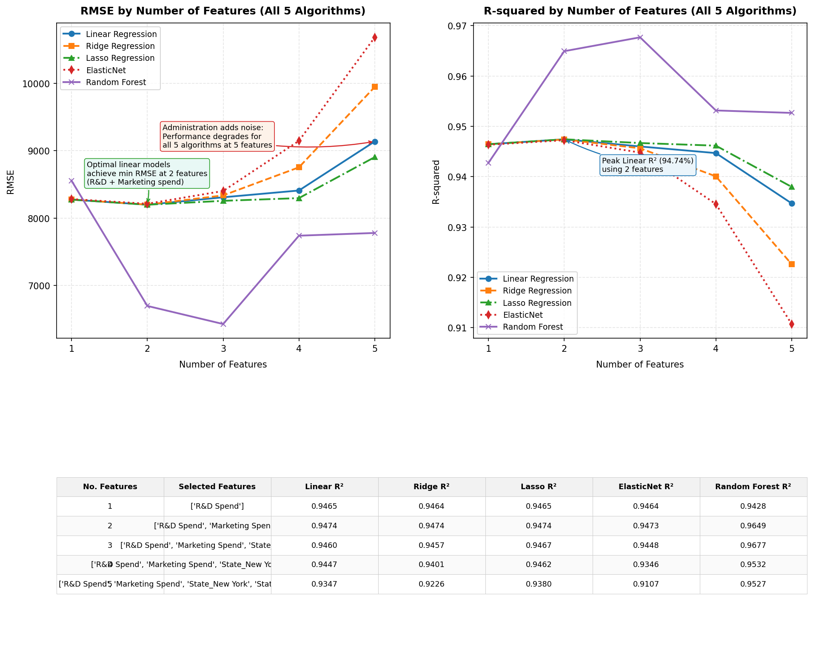

# Kaggle 50 Startups Profit Prediction: CRISP-DM Pipeline

This repository contains a complete, robust machine learning pipeline for predicting startup profitability based on budget allocations across R&D, Administration, and Marketing expenditures, alongside geographical location (State).

🌐 **Interactive Live Demo**: [Kaggle 50 Startups Profit Predictor](https://kaggle50startup-kuan.streamlit.app/)

🎥 **Video Introduction**: [Kaggle 50 Startups Profit Prediction Video Overview](https://drive.google.com/file/d/1h4sVaSM_jseeHHVlCHuCg-b3hizMkT49/view?usp=sharing)

---

## 🚀 Key Results & Insights

*   **Optimal Model**: **Lasso Regression** trained on a 2-feature subset (`[R&D Spend, Marketing Spend]`) achieves peak generalizability.
    *   **Test Set $R^2$**: `94.74%`
    *   **Test Set MAE**: `$6,453.44`
*   **R&D Spend is the Dominant Driver**: Both linear coefficients and Random Forest feature importance verify that R&D investment is the single most critical predictor of profit ($92.71\%$ importance).
*   **Administration Spend is Noise**: Adding Administration spend to the model decreases model performance (RMSE increases by **11.4%**), proving it behaves as noise with respect to profit.
*   **State is a Proxy**: Dummy variables for state location (California, Florida, New York) show minimal impact, indicating geography has little direct causal effect on profitability.

---

## 📊 Performance Comparison (All 5 Algorithms)

Below is the performance comparison showing how 5 different algorithms behave as features are added sequentially:
1.  `[R&D Spend]`
2.  `[R&D Spend, Marketing Spend]`
3.  `[R&D Spend, Marketing Spend, New York]`
4.  `[R&D Spend, Marketing Spend, New York, Florida]`
5.  `[R&D Spend, Marketing Spend, New York, Florida, Administration]`



---

## 📄 Technical Whitepaper & Specification

The repository includes a comprehensive, 25-page **Technical Whitepaper and System Specification** documenting the entire machine learning pipeline.

* 📕 **Technical Whitepaper**: [kaggle_50_startups_technical_whitepaper_spec.pdf](./kaggle_50_startups_technical_whitepaper_spec.pdf)


### Document Outline & Table of Contents:
1. **文件目的與適用範圍** (Purpose & Scope)
2. **專案背景與問題定義** (Project Background & Problem Definition)
3. **成功準則與驗收標準** (Success Criteria & Acceptance Standards)
4. **CRISP-DM 方法論總覽** (CRISP-DM Methodology Overview)
5. **資料集規格** (Dataset Specifications)
6. **欄位字典與資料語意** (Data Dictionary & Semantics)
7. **資料探索分析規格** (EDA Specifications)
8. **EDA 關鍵發現** (Key EDA Findings)
9. **資料切分與實驗可重現性** (Data Split & Reproducibility)
10. **特徵工程規格** (Feature Engineering Specifications)
11. **前處理管線規格** (Preprocessing Pipeline Specifications)
12. **模型候選集合** (Model Candidate Set)
13. **特徵子集合設計** (Feature Subset Design)
14. **超參數調校規格** (Hyperparameter Tuning Specifications)
15. **模型效能表與解讀** (Model Performance Table & Interpretation)
16. **最佳模型決策** (Best Model Decision)
17. **Administration 特徵風險分析** (Risk Analysis of Administration Feature)
18. **部署架構規格** (Deployment Architecture Specifications)
19. **API 與函式規格** (API & Function Specifications)
20. **檔案與目錄結構規格** (File & Directory Structure Specifications)
21. **測試策略與品質保證** (Testing Strategy & Quality Assurance)
22. **風險、限制與假設** (Risks, Constraints, & Assumptions)
23. **安全性、隱私與治理** (Security, Privacy, & Governance)
24. **維運與模型監控** (Operations & Model Monitoring)
25. **報告、簡報與溝通規格** (Reporting, Presentation, & Communication Specifications)
26. **未來擴充方向** (Future Extensions)
27. **結論** (Conclusion)

---

## 📁 Repository Structure

```text
├── data.csv                                        # Kaggle 50 Startups source dataset
├── design.md                                       # Project requirements and CRISP-DM design system
├── solve_50_startups.py                            # Core pipeline script (EDA, tuning, report generation)
├── generate_summary_plot.py                        # Code for annotated single-model summary plot
├── generate_allinone_plot.py                       # Code for multi-model all-in-one comparisons
├── startup_profit_model.pkl                        # Serialized Lasso Regression production pipeline
├── business_report.md                              # Generated CRISP-DM business report
├── README.md                                       # Project overview (this file)
├── hw6.md                                          # Homework submission summary
├── kaggle_50_startups_technical_whitepaper_spec.pdf  # Technical whitepaper & specification (PDF)
├── kaggle_50_startups_technical_whitepaper_spec.docx # Technical whitepaper & specification (Word DOCX)
└── plots/                                          # Output directory for plots
    ├── histograms.png
    ├── scatter_plots.png
    ├── categorical_plots.png
    ├── correlation_heatmap.png
    ├── feature_selection_annotated.png
    └── allinone.png
```

---

## 🛠️ Installation & Execution

### 1. Install Dependencies
```bash
pip install pandas numpy scikit-learn matplotlib seaborn joblib
```

### 2. Run the Core Machine Learning Pipeline
This command executes EDA, fits models across 5 experiments (E1 to E5) with GridSearchCV 5-fold CV, saves the best model to `startup_profit_model.pkl`, and creates `business_report.md`.
```bash
python solve_50_startups.py
```

### 3. Generate Comparative Plots
```bash
python generate_summary_plot.py
python generate_allinone_plot.py
```

---

## 🔮 Deployment & Inference
You can directly import and call `predict_profit` in Python:

```python
from solve_50_startups import predict_profit

# Predict profit for a startup:
# R&D Spend = $100k, Admin = $90k, Marketing = $200k, State = 'New York'
predicted = predict_profit(
    rd_spend=100000.0,
    admin_spend=90000.0,
    marketing_spend=200000.0,
    state='New York'
)
print(f"Predicted Profit: ${predicted:,.2f}")
```
