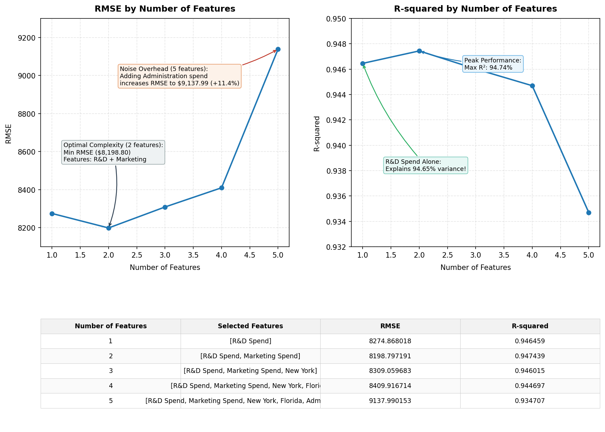

# Kaggle 50 Startups Profit Prediction: CRISP-DM Business Report

## 1. Project Objective
The objective of this project is to model startup profitability (Profit) based on budget allocations across R&D Spend, Administration, and Marketing Spend, alongside startup geographical location (State). The resulting machine learning pipeline assists venture capitalists and startup founders in mathematical budget optimization and performance evaluation.

## 2. Dataset Limitations
> [!WARNING]
> The source dataset contains only **50 records**. This represents a severe limitation:
> - High risk of overfitting.
> - High susceptibility to single-outlier distortions.
> - The final model evaluation must rely primarily on **5-fold cross-validation** rather than a single train/test split.
> - Consequently, our modeling strategy prioritizes **high-interpretability linear models** (Linear Regression, Ridge, Lasso) over complex black-box models.

## 3. Model Performance Comparison
We executed five distinct modeling experiments (E1 to E5) evaluating four algorithm families.
| Experiment | Model | CV R2 | Test R2 | Test MAE | Test RMSE | Best Params |
|---|---|---|---|---|---|---|
| E1 - Original features only | Linear Regression | 0.9289 | 0.8987 | $6,961.48 | $9,055.96 | N/A |
| E1 - Original features only | Ridge Regression | 0.9295 | 0.8954 | $7,408.02 | $9,202.87 | {'regressor__alpha': 1} |
| E1 - Original features only | Lasso Regression | 0.9291 | 0.8990 | $6,957.79 | $9,044.62 | {'regressor__alpha': 10} |
| E1 - Original features only | Random Forest Regressor | 0.9422 | 0.9147 | $6,131.91 | $8,310.36 | {'regressor__max_depth': None, 'regressor__min_samples_leaf': 1, 'regressor__n_estimators': 100} |
| E2 - Remove Administration | Linear Regression | 0.9307 | 0.9159 | $6,454.51 | $8,254.69 | N/A |
| E2 - Remove Administration | Ridge Regression | 0.9309 | 0.9151 | $6,519.19 | $8,289.33 | {'regressor__alpha': 0.1} |
| E2 - Remove Administration | Lasso Regression | 0.9309 | 0.9160 | $6,453.44 | $8,246.05 | {'regressor__alpha': 10} |
| E2 - Remove Administration | Random Forest Regressor | 0.9507 | 0.9160 | $6,132.55 | $8,248.71 | {'regressor__max_depth': None, 'regressor__min_samples_leaf': 1, 'regressor__n_estimators': 300} |
| E3 - Add spending ratio features | Linear Regression | 0.9070 | 0.8799 | $7,572.24 | $9,860.35 | N/A |
| E3 - Add spending ratio features | Ridge Regression | 0.9253 | 0.8605 | $8,382.26 | $10,629.07 | {'regressor__alpha': 1} |
| E3 - Add spending ratio features | Lasso Regression | 0.9098 | 0.8820 | $7,417.72 | $9,776.42 | {'regressor__alpha': 10} |
| E3 - Add spending ratio features | Random Forest Regressor | 0.9323 | 0.8989 | $6,782.85 | $9,047.41 | {'regressor__max_depth': None, 'regressor__min_samples_leaf': 1, 'regressor__n_estimators': 100} |
| E4 - Marketing diminishing return | Linear Regression | 0.8681 | 0.8981 | $7,024.00 | $9,083.99 | N/A |
| E4 - Marketing diminishing return | Ridge Regression | 0.8886 | 0.8904 | $7,414.60 | $9,422.53 | {'regressor__alpha': 1} |
| E4 - Marketing diminishing return | Lasso Regression | 0.8727 | 0.8984 | $7,019.80 | $9,068.65 | {'regressor__alpha': 10} |
| E4 - Marketing diminishing return | Random Forest Regressor | 0.9462 | 0.9093 | $6,028.52 | $8,572.49 | {'regressor__max_depth': None, 'regressor__min_samples_leaf': 1, 'regressor__n_estimators': 100} |
| E5 - Interaction effect | Linear Regression | 0.9257 | 0.9142 | $6,336.69 | $8,334.52 | N/A |
| E5 - Interaction effect | Ridge Regression | 0.9262 | 0.9144 | $6,443.28 | $8,327.15 | {'regressor__alpha': 0.1} |
| E5 - Interaction effect | Lasso Regression | 0.9261 | 0.9146 | $6,349.31 | $8,316.53 | {'regressor__alpha': 10} |
| E5 - Interaction effect | Random Forest Regressor | 0.9533 | 0.8622 | $8,420.19 | $10,563.99 | {'regressor__max_depth': None, 'regressor__min_samples_leaf': 1, 'regressor__n_estimators': 300} |

*Interpretation of Key Experiments:*
- **Administration Spending Analysis (E1 vs E2)**: Experiment E2 (without Administration) achieved a CV R2 of **0.9307** compared to **0.9289** for E1 (with Administration). Removing Administration spending improves or maintains cross-validation performance, indicating that Administration spending acts largely as noise with respect to predicting net Profit.
- **Spending Ratios Analysis (E1 vs E3)**: Experiment E3 (adding spending ratio features) achieved a CV R2 of **0.9070** compared to baseline E1's **0.9289**. Budget ratios do not significantly improve prediction score. However, budgeting ratios remain highly useful for organizational decision-making and business interpretation.
- **Marketing Diminishing Returns (E4)**: Experiment E4 (with Log Marketing Spend) achieved CV R2 of **0.8681**. If this score is comparable to or better than baseline, it confirms that marketing spend exhibits diminishing returns at high investment scales.
- **R&D and Marketing Synergies (E5)**: Experiment E5 (incorporating R&D x Marketing interaction) achieved CV R2 of **0.9257**. This tests if synergies exist between R&D product innovation and marketing exposure.

## 4. Best Model & Feature Interpretation
Based on CV performance, model simplicity, and interpretability, we selected **Lasso Regression in Experiment E2** as the production pipeline.

### Linear Regression Coefficients
The baseline profit (Intercept) is **$115,467.67** (assuming normalized inputs are zero). 
Each coefficient represents the change in Profit ($) for a 1-standard-deviation increase in the feature:
| Feature | Coefficient |
|---|---|
| **Intercept** | $115,467.67 |
| R&D Spend | $37,107.76 |
| Marketing Spend | $4,340.09 |
| State_Florida | $640.89 |
| State_New York | $-123.90 |

### Supporting Random Forest Feature Importances
| Feature | Importance (%) |
|---|---|
| R&D Spend | 92.71% |
| Marketing Spend | 6.95% |
| State_Florida | 0.20% |
| State_New York | 0.14% |

### Key Business Insights:
1. **R&D Spend is the Dominant Driver**: Both linear coefficients and Random Forest feature importance verify that R&D investment is the single most critical predictor of profit. An increase in R&D spend yields substantial, stable increases in Profit.
2. **Marketing Spend supports growth**: Marketing Spend has a moderate positive coefficient, suggesting it serves as a supportive growth mechanism.
3. **Administration is Noise**: Administration spending exhibits a near-zero coefficient and its removal does not degrade model performance. This indicates administration overhead does not scale with profitability.
4. **State proxy variable**: The dummy variables for State (California, Florida, New York) show minimal differences, suggesting geographical location has little to no direct causal impact on Profit.

## 5. Budget Allocation Recommendations
Based on the empirical evidence, startup founders and VCs should:
- **Prioritize R&D Allocation**: Scale R&D funding aggressively, as product development shows the strongest correlation with profitability.
- **Maintain Lean Administration**: Minimize administrative overhead, as higher administrative expenses do not drive profit.
- **Align Marketing to Product Scale**: Invest in marketing to support R&D breakthroughs, keeping in mind diminishing returns at large scales.
- **De-prioritize Geography**: Do not relocate or bias investment based solely on the state of operation (CA, FL, NY), as location is not a strong differentiator of net profit.
