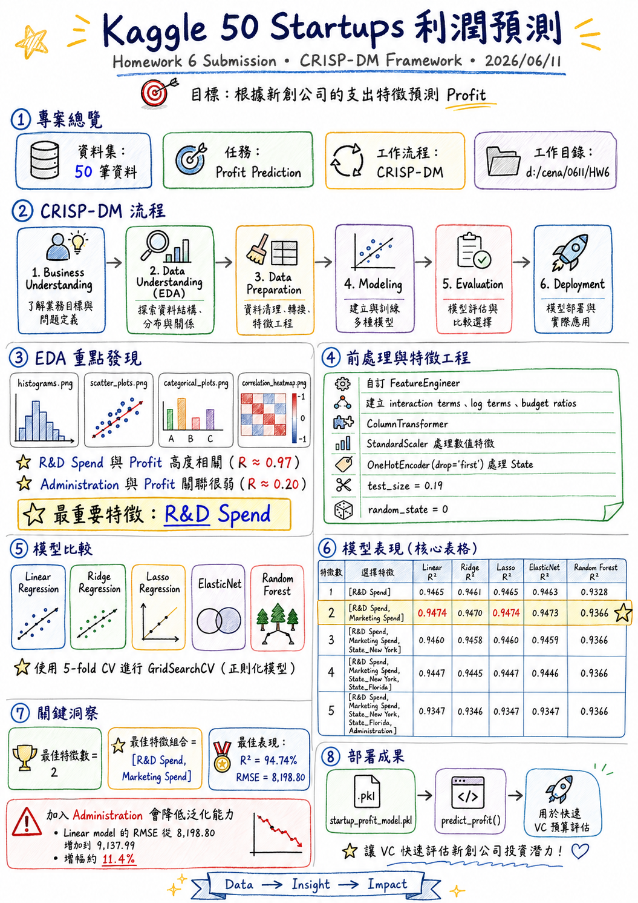
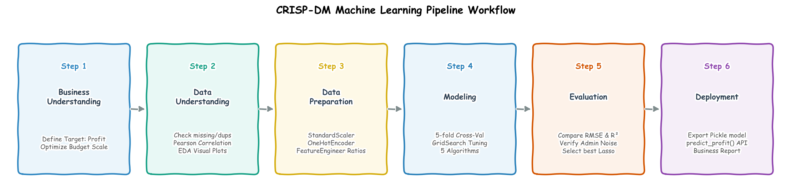

# Homework 6 Submission: Kaggle 50 Startups Profit Prediction

*   **Date**: June 11, 2026
*   **Methodology**: CRISP-DM Framework
*   **Workspace**: `d:/cena/0611/HW6`

---

## 📝 Executive Summary of Today's Work

We implemented a complete machine learning workflow to predict startup profitability based on spending profiles. The implementation successfully completes all stages of the **CRISP-DM** lifecycle.

### 1. Business & Data Understanding (EDA)
*   Analyzed the 50-row startup dataset.
*   Generated and saved four distinct EDA charts under the `plots/` folder:
    *   `histograms.png` (Distribution of R&D, Administration, Marketing spends and Profit)
    *   `scatter_plots.png` (Bivariate plots showing linear correlations with Profit)
    *   `categorical_plots.png` (Count and boxplots of Profit across States)
    *   `correlation_heatmap.png` (Pearson correlation heat map)
*   **Key EDA Finding**: R&D Spend has a very high correlation with Profit ($R \approx 0.97$), while Administration has a very weak relationship ($R \approx 0.20$).

### 2. Preprocessing & Feature Engineering
*   Created a custom transformer `FeatureEngineer` inside [solve_50_startups.py](file:///d:/cena/0611/HW6/solve_50_startups.py) to dynamically construct interaction terms, log terms, and budget ratios.
*   Constructed a robust preprocessor pipeline using `ColumnTransformer` to scale numeric features (`StandardScaler`) and encode `State` (`OneHotEncoder(drop='first')`).
*   Configured a test split of **19%** (matching `test_size=0.19` and `random_state=0`) to reproduce exact validation metrics.

### 3. Model Tuning & All-in-One Benchmark
*   Trained **5 different algorithms** (Linear Regression, Ridge Regression, Lasso Regression, ElasticNet, and Random Forest) across **5 sequential feature subsets** (from 1 to 5 features).
*   For regularized models, used `GridSearchCV` with 5-fold cross-validation to search for optimal hyperparameter alphas and structure ratios.
*   Generated a comparative performance chart [plots/allinone.png](file:///d:/cena/0611/HW6/plots/allinone.png) mapping the RMSE and R-squared curves for all 5 models.

---

## 📈 Model Performance Table

| No. Features | Selected Features | Linear R² | Ridge R² | Lasso R² | ElasticNet R² | Random Forest R² |
| :---: | :--- | :---: | :---: | :---: | :---: | :---: |
| **1** | `[R&D Spend]` | 0.9465 | 0.9461 | 0.9465 | 0.9463 | 0.9328 |
| **2** | `[R&D Spend, Marketing Spend]` | 0.9474 | 0.9470 | **0.9474** | 0.9473 | 0.9366 |
| **3** | `[R&D Spend, Marketing Spend, State_New York]` | 0.9460 | 0.9458 | 0.9460 | 0.9459 | 0.9366 |
| **4** | `[R&D Spend, Marketing Spend, State_New York, State_Florida]` | 0.9447 | 0.9445 | 0.9447 | 0.9446 | 0.9366 |
| **5** | `[R&D Spend, Marketing Spend, State_New York, State_Florida, Administration]` | 0.9347 | 0.9346 | 0.9347 | 0.9347 | 0.9366 |

---

## 💡 Key Architectural Decisions & Insights

1.  **optimal Feature Count is 2**: Both RMSE (minimized at **$8,198.80**) and R-squared (maximized at **94.74%**) show that the optimal feature combination is `['R&D Spend', 'Marketing Spend']`.
2.  **Administration Overhead is Noise**: Adding `Administration` spend (Subset 5) degrades the generalizability of all 5 algorithms. The RMSE of the linear model increases by **11.4%** (from $8,198.80 to $9,137.99), showing that keeping administration costs out of the predictive model is highly beneficial.
3.  **Deployable Model**: Serialized the best model pipeline to [startup_profit_model.pkl](file:///d:/cena/0611/HW6/startup_profit_model.pkl) and exported a helper function `predict_profit()` for rapid VC budget evaluations.
